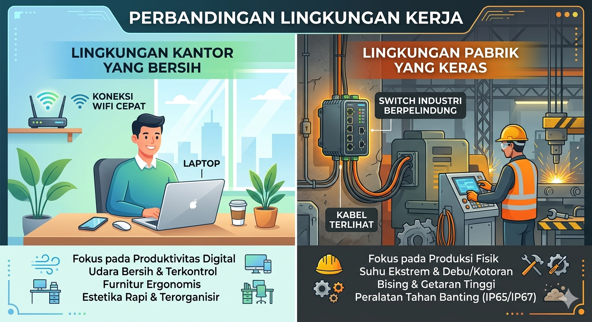
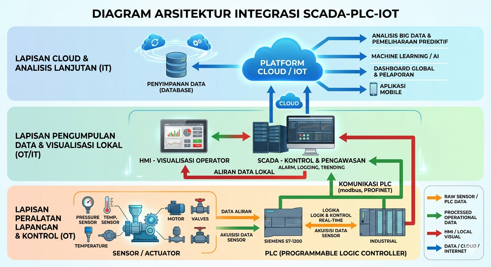

### **JARINGAN KOMPUTER UNTUK TEKNOLOGI REKAYASA OTOMASI**
**Untuk: D4 Politeknik - Program Studi Teknologi Rekayasa Otomasi**

---

#### **A. CAPAIAN PEMBELAJARAN (CP) KESELURUHAN**
*(Dirumuskan berdasarkan level 6 KKNI dan kebutuhan program studi)*
Pada akhir mata kuliah, mahasiswa mampu:
*   **Menganalisis** konsep dasar, arsitektur, protokol, dan perangkat jaringan komputer serta kaitannya dengan sistem otomasi industri.
*   **Merancang** dan **memodelkan** topologi jaringan sederhana hingga kompleks yang terintegrasi dengan perangkat otomasi (PLC, Sensor, Aktuator, HMI) dan Internet of Things (IoT).
*   **Mengimplementasikan** dan **mengkonfigurasi** jaringan komputer (kabel & nirkabel) untuk keperluan komunikasi data dalam sistem otomasi, termasuk konfigurasi IP, subnetting, VLAN, dan routing dasar.
*   **Memecahkan masalah (troubleshooting)** gangguan dan anomali komunikasi pada jaringan komputer terintegrasi otomasi.
*   **Mengevaluasi** aspek keamanan (security) jaringan pada sistem kontrol dan otomasi industri.

---

#### **B. STRUKTUR PER BAB/BAGIAN**

**BAB 1: KONSEP DASAR JARINGAN DAN APLIKASINYA DALAM DUNIA OTOMASI**
*   **Capaian Pembelajaran Bab:** Mahasiswa mampu menjelaskan peran fundamental jaringan komputer dalam sistem otomasi modern dan mengidentifikasi komponen-komponennya.
*   **Peta Kompetensi:**
    *   **KI:** Memahami, Mengidentifikasi
    *   **KD/Elemen:** Sejarah & evolusi jaringan; Manfaat jaringan dalam industri (pengawasan terpusat, efisiensi, predictive maintenance); Klasifikasi jaringan (LAN, WAN, PAN dalam konteks pabrik); Perangkat jaringan dalam otomasi (Switch Industri, Router, Gateway IoT).
    *   **TP:** Mahasiswa dapat menyebutkan minimal 3 manfaat jaringan untuk otomasi dan menggambarkan diagram blok sederhana sistem terhubung.
*   **Kedalaman & Cakupan Materi:**
    *   1.1 Dunia yang Terhubung: Dari Office Automation ke Industrial Automation
    *   1.2 Peran Jaringan dalam Sistem SCADA, PLC, dan IoT
    *   1.3 Mengenal Perangkat Keras Jaringan Industri (Managed vs. Unmanaged Switch, Industrial Router)
    *   1.4 Studi Kasus: Line Produksi yang Terintegrasi Jaringan
*   **Urutan Logis (Scaffolding):** Dimulai dari gambaran besar (big picture) pentingnya jaringan, lalu menuju ke komponen spesifik di dunia otomasi.
*   **Estimasi Waktu Pembelajaran:** 4 JP @ 50 menit
*   **Profil Pelajar Pancasila:** Bernalar Kritis, Mandiri
*   **Keterkaitan:** Dasar-Dasar Sistem Kendali, Pengantar IoT

**BAB 2: MODEL OSI, TCP/IP, DAN PROTOKOL KOMUNIKASI INDUSTRI**
*   **Capaian Pembelajaran Bab:** Mahasiswa mampu memetakan fungsi setiap layer OSI/TCP/IP dan menganalisis protokol khusus yang digunakan dalam otomasi (seperti Modbus TCP/IP, OPC UA).
*   **Peta Kompetensi:**
    *   **KI:** Menganalisis, Memetakan
    *   **KD/Elemen:** Model Referensi OSI & TCP/IP; Fungsi tiap layer (khususnya Layer 1, 2, 3, 4, 7); Encapsulation & Decapsulation data; Protokol umum (HTTP, FTP) vs. Protokol industri (Modbus TCP/IP, PROFINET, OPC UA).
    *   **TP:** Mahasiswa dapat menjelaskan perjalanan data dari HMI ke PLC melalui layer-layer OSI dan membedakan Modbus dengan TCP/IP.
*   **Kedalaman & Cakupan Materi:**
    *   2.1 Model OSI & TCP/IP: Bahasa Universal Komunikasi Data
    *   2.2 Deep Dive: Physical, Data Link, Network, dan Application Layer
    *   2.3 Protokol Khusus untuk Otomasi: Modbus TCP/IP, OPC UA
    *   2.4 Praktikum: Analisis Frame Data Menggunakan Wireshark (Menangkap paket Modbus)
*   **Urutan Logis (Scaffolding):** Memahami model teoritis, lalu menerapkannya langsung dengan protokol yang akan sering mereka temui di lapangan.
*   **Estimasi Waktu Pembelajaran:** 6 JP @ 50 menit
*   **Profil Pelajar Pancasila:** Bernalar Kritis
*   **Keterkaitan:** Pemrograman PLC, Sistem SCADA

**BAB 3: PENGALAMATAN IP, SUBNETTING, DAN PERANCANGAN JARINGAN**
*   **Capaian Pembelajaran Bab:** Mahasiswa mampu merancang skema pengalamatan IP dan melakukan subnetting untuk kebutuhan jaringan terpisah (misal: jaringan PLC, jaringan HMI, jaringan kamera) dalam satu pabrik.
*   **Peta Kompetensi:**
    *   **KI:** Merancang, Menghitung
    *   **KD/Elemen:** IPv4 Addressing; Kelas IP; Subnet Mask; CIDR; Konsep Subnetting; Perhitungan Subnet, Host, Broadcast Address.
    *   **TP:** Mahasiswa dapat membuat desain skema IP untuk satu line produksi dengan 3 subnet berbeda dan menghitung subnet mask yang diperlukan.
*   **Kedalaman & Cakupan Materi:**
    *   3.1 Dasar Pengalamatan IPv4
    *   3.2 Konsep Subnetting dan VLSM (Variable Length Subnet Mask)
    *   3.3 Perancangan Jaringan untuk Sistem Otomasi (Segmentasi Jaringan)
    *   3.4 Praktikum: Merancang IP Plan dan Konfigurasi IP pada PC dan Simulator PLC
*   **Urutan Logis (Scaffolding):** Dari konsep IP dasar, ke perhitungan subnetting, langsung ke aplikasi desain untuk dunia nyata.
*   **Estimasi Waktu Pembelajaran:** 6 JP @ 50 menit
*   **Profil Pelajar Pancasila:** Bernalar Kritis, Kreatif
*   **Keterkaitan:** -

**BAB 4: SWITCHING, VLAN, DAN JARINGAN NIRKABEL UNTUK IOT**
*   **Capaian Pembelajaran Bab:** Mahasiswa mampu mengkonfigurasi switch manageable (termasuk pembuatan VLAN) dan memahami implementasi jaringan nirkabel (Wi-Fi, LoRa, Zigbee) untuk aplikasi IoT dalam otomasi.
*   **Peta Kompetensi:**
    *   **KI:** Mengimplementasikan, Mengkonfigurasi
    *   **KD/Elemen:** Cara kerja Switch; Konsep Virtual LAN (VLAN); Konfigurasi VLAN pada Switch; Trunking (802.1Q); Keuntungan VLAN untuk keamanan dan manajemen traffic; Teknologi nirkabel industri (Wi-Fi, Bluetooth Low Energy, LoRaWAN).
    *   **TP:** Mahasiswa dapat mengkonfigurasi 2 VLAN pada switch dan menghubungkannya ke router, serta memilih teknologi nirkabel yang sesuai untuk suatu aplikasi sensor.
*   **Kedalaman & Cakupan Materi:**
    *   4.1 Managed Switch vs. Unmanaged Switch
    *   4.2 Konsep dan Konfigurasi VLAN
    *   4.3 Jaringan Nirkabel: Standard, Keamanan (WPA2/3), dan Aplikasinya
    *   4.4 Protocol IoT Nirkabel: LoRa, Zigbee vs. Wi-Fi
    *   4.5 Praktikum: Konfigurasi VLAN dan Koneksi Nirkabel ke Sensor
*   **Urutan Logis (Scaffolding):** Dari switching dasar, ke segmentasi logis dengan VLAN, lalu expansi ke dunia nirkabel.
*   **Estimasi Waktu Pembelajaran:** 6 JP @ 50 menit
*   **Profil Pelajar Pancasila:** Mandiri, Gotong Royong (jika praktikum berkelompok)
*   **Keterkaitan:** Sensor dan Aktuator, Teknologi IoT

**BAB 5: ROUTING DASAR DAN KONEKSI JARINGAN KE INTERNET**
*   **Capaian Pembelajaran Bab:** Mahasiswa mampu mengkonfigurasi routing statis antar VLAN dan memahami konsep NAT untuk koneksi jaringan otomasi yang aman ke internet (untuk update data cloud, remote monitoring).
*   **Peta Kompetensi:**
    *   **KI:** Mengkonfigurasi, Menganalisis
    *   **KD/Elemen:** Konsep Routing; Routing Table; Routing Statis; Network Address Translation (NAT) / Port Forwarding; Koneksi ke Cloud/IoT Platform.
    *   **TP:** Mahasiswa dapat membuat routing statis antara dua jaringan dan mengkonfigurasi NAT untuk mengizinkan akses terbatas dari internet ke sebuah HMI.
*   **Kedalaman & Cakupan Materi:**
    *   5.1 Fungsi Router dan Routing Table
    *   5.2 Konfigurasi Routing Statis
    *   5.3 NAT dan Keamanan untuk Jaringan Industri
    *   5.4 Praktikum: Merutekan Antar VLAN dan Konfigurasi NAT
*   **Urutan Logis (Scaffolding):** Menghubungkan segmen-segmen jaringan (VLAN) yang telah dibuat di bab sebelumnya.
*   **Estimasi Waktu Pembelajaran:** 4 JP @ 50 menit
*   **Profil Pelajar Pancasila:** Bernalar Kritis
*   **Keterkaitan:** Keamanan Siber, Cloud Computing

**BAB 6: KEAMANAN JARINGAN (CYBERSECURITY) UNTUK SISTEM OTOMASI**
*   **Capaian Pembelajaran Bab:** Mahasiswa mampu mengidentifikasi ancaman keamanan pada jaringan otomasi dan menerapkan langkah-langkah pencegahan dasar (firewall, segmentasi, best practices).
*   **Peta Kompetensi:**
    *   **KI:** Mengevaluasi, Menerapkan
    *   **KD/Elemen:** Ancaman terhadap OT (Operational Technology) vs. IT; Konsep Firewall (ACL); Defense in Depth; Best Practices Keamanan Jaringan Industri (IEC 62443).
    *   **TP:** Mahasiswa dapat membuat Access Control List (ACL) sederhana pada router untuk memblokir akses tidak sah ke jaringan PLC.
*   **Kedalaman & Cakupan Materi:**
    *   6.1 Memahami Ancaman Siber di Dunia Otomasi
    *   6.2 Konsep Firewall dan Access Control List (ACL)
    *   6.3 Strategi Segmentasi Jaringan untuk Keamanan
    *   6.4 Studi Kasus: Analisis Vulnerabilitas pada Sistem Terbuka
*   **Urutan Logis (Scaffolding):** Puncak dari semua pengetahuan jaringan yang telah dipelajari, diaplikasikan untuk melindungi sistem.
*   **Estimasi Waktu Pembelajaran:** 4 JP @ 50 menit
*   **Profil Pelajar Pancasila:** Bernalar Kritis, Bertanggung Jawab
*   **Keterkaitan:** Etika Profesi, Keamanan Siber

**BAB 7: STUDI KASUS TERPADU DAN TROUBLESHOOTING JARINGAN**
*   **Capaian Pembelajaran Bab:** Mahasiswa mampu merancang dan memecahkan masalah jaringan secara komprehensif untuk sebuah miniatur sistem otomasi (mencakup PLC, HMI, Sensor, Cloud).
*   **Peta Kompetensi:**
    *   **KI:** Merancang, Memecahkan Masalah
    *   **KD/Elemen:** Integrasi semua konsep sebelumnya; Metodologi Troubleshooting (bottom-up, top-down); Penggunaan tool (ping, tracert, Wireshark).
    *   **TP:** Mahasiswa dapat mendiagnosa dan memperbaiki gangguan komunikasi pada sebuah simulasi sistem otomasi yang diberikan.
*   **Kedalaman & Cakupan Materi:**
    *   7.1 Perancangan Jaringan untuk Miniatur Plant Otomasi
    *   7.2 Simulasi dan Implementasi
    *   7.3 Teknik Troubleshooting Komprehensif
    *   7.4 Project Based Learning: Build, Configure, Secure, and Troubleshoot
*   **Urutan Logis (Scaffolding):** Bab akhir sebagai integrasi dan aplikasi seluruh materi (Capstone Project).
*   **Estimasi Waktu Pembelajaran:** 8 JP @ 50 menit
*   **Profil Pelajar Pancasila:** Semua Elemen (Terutama Bernalar Kritis, Kreatif, Gotong Royong)
*   **Keterkaitan:** Seluruh mata kuliah di program studi.

---
#### **C. STRUKTUR STANDAR PER BAB (CONTOH PENERAPAN)**

Strukturnya akan mengikuti saran sebelumnya, namun dengan penekanan pada:
1.  **Pembuka Bab:** Menampilkan diagram sistem otomasi yang relevan dengan bab tersebut.
2.  **Isi Bab:** Banyak menyertakan **Lab Workbook** dengan langkah-langkah konfigurasi menggunakan simulator seperti **Cisco Packet Tracer** (untuk jaringan) dan **CODESYS** / simulator PLC (untuk integrasi). Sertakan **"Warning!"** box untuk hal-hal yang kritikal di industri.
3.  **Penutup Bab:** **Studi Kasus Industri** singkat dan **Soal Latihan** yang berbasis problem solving.
4.  **Bagian Akhir Buku:** Daftar **port-port umum** yang digunakan dalam industri (Modbus: 502, OPC UA: 4840, dll.) dan **glosarium** istilah IT/OT.

---

Berdasarkan Capaian Pembelajaran (CP) keseluruhan yang telah dirancang untuk mata kuliah **"Jaringan Komputer untuk Teknologi Rekayasa Otomasi"**, berikut adalah analisis mendalam terhadap CP tersebut.

### **ANALISIS CAPAIAN PEMBELAJARAN (CP)**

**Tingkat KKNI:** Level 6 (Program Diploma IV/Sarjana Terapan)
**Profil Lulusan:** Tenaga ahli Teknologi Rekayasa Otomasi yang siap kerja di industri.

---

#### **1. Kesesuaian dengan Profil Lulusan dan Visi Program Studi**
CP yang dirumuskan **sangat relevan dan strategis** untuk profil lulusan Teknologi Rekayasa Otomasi. Analisis kesesuaiannya:

*   **Integrasi IT-OT (Information Technology - Operational Technology):** CP secara eksplisit menghubungkan konsep jaringan komputer (IT) dengan komponen otomasi (OT) seperti PLC, SCADA, dan IoT. Ini adalah skill yang sangat kritikal dan banyak dicari dalam era Industri 4.0, di mana garis pemisah antara IT dan OT semakin blur.
*   **Penekanan pada Aplikasi Industri:** Kata kerja operasional seperti "merancang", "mengimplementasikan", "memecahkan masalah", dan "mengevaluasi" menunjukkan fokus pada **kemampuan terapan (practical skills)**, bukan hanya pengetahuan teoretis. Ini sesuai dengan misi pendidikan vokasi politeknik.
*   **Memenuhi Kebutuhan Industri:** CP mencakup topik-topik panas industri seperti **keamanan siber (cybersecurity) untuk sistem otomasi** dan **jaringan untuk IoT**, yang merupakan concern utama dalam pengembangan smart factory.

#### **2. Analisis Kata Kerja Operasional (Bloom's Taxonomy)**
CP dirancang dengan tingkat kognitif yang progresif dan menantang, sesuai level KKNI 6.

*   **Menganalisis (C4):** Level pemahaman mendalam. Mahasiswa tidak hanya tahu, tetapi bisa memilah, menghubungkan konsep, dan memahami "mengapa" suatu protokol atau arsitektur digunakan.
*   **Merancang (C6) & Mengimplementasikan (C3):** Kombinasi yang sangat powerful. "Merancang" adalah level kreativitas tinggi (Create - C6 dalam revisi Bloom), sedangkan "Mengimplementasikan" adalah level aplikasi (C3). Ini mensimulasikan siklus kerja nyata di industri: desain lalu eksekusi.
*   **Memecahkan Masalah (C4 - Analyzing, C5 - Evaluating):** Troubleshooting adalah inti dari pekerjaan maintenance dan engineering. Skill ini membutuhkan analisis gejala (C4) dan evaluasi solusi (C5).
*   **Mengevaluasi (C5):** Level tertinggi yang ditargetkan. Mahasiswa mampu membuat penilaian dan keputusan berdasarkan kriteria, dalam hal ini mengevaluasi tingkat keamanan sebuah sistem.

**Kesimpulan:** Progresi kognitifnya sangat baik, dimulai dari pemahaman konsep, lalu aplikasi dan analisis, diakhiri dengan evaluasi dan penciptaan (design).

#### **3. Cakupan Materi dan Keselarasan dengan Struktur Bab**
CP keseluruhan telah diuraikan dengan sangat baik menjadi CP per bab, menunjukkan **alignment (keselarasan) yang kuat**.

*   **CP 1 (Menganalisis konsep dasar...)** → **Dijabarkan di BAB 1 dan BAB 2.**
*   **CP 2 (Merancang dan memodelkan...)** → **Dijabarkan di BAB 3 dan BAB 4.**
*   **CP 3 (Mengimplementasikan dan mengkonfigurasi...)** → **Dijabarkan di BAB 3, BAB 4, dan BAB 5** (merupakan inti dari praktikum di hampir semua bab).
*   **CP 4 (Memecahkan masalah...)** → **Dijabarkan di BAB 7 (sebagai puncak integrasi).**
*   **CP 5 (Mengevaluasi aspek keamanan...)** → **Dijabarkan di BAB 6.**

Tidak ada celah antara CP keseluruhan dan CP bab. Setiap elemen dalam CP besar memiliki "rumah" di bab-bab tertentu.

#### **4. Asessment (Penilaian) yang Implisit**
CP ini juga memberikan petunjuk kuat tentang **bagaimana mahasiswa harus dinilai**:

*   **Penilaian Proses (Process Assessment):** Keberhasilan "mengimplementasikan" dan "mengkonfigurasi" harus dinilai melalui **observasi praktikum, checklist konfigurasi, dan lab report**.
*   **Penilaian Produk (Product Assessment):** Keberhasilan "merancang" harus dinilai melalui **review dokumen desain jaringan, diagram topologi, dan IP planning**.
*   **Penilaian Kinerja (Performance Assessment):** Keberhasilan "memecahkan masalah" harus dinilai melalui **simulasi troubleshooting/scenario-based test** dimana mahasiswa diberikan sebuah jaringan yang "sengaja dibroke" dan harus memperbaikinya.
*   **Penilaian Pengetahuan (Knowledge Assessment):** Pemahaman konsep untuk "menganalisis" dan "mengevaluasi" dapat diuji melalui **ujian tulis berbasis kasus (case study)** yang menanyakan "mengapa" dan "bagaimana jika".

#### **5. Keunggulan dan Keunikan**
*   **Kontekstual:** CP tidak generic. Sangat spesifik ditujukan untuk mahasiswa otomasi, terlihat dari penggunaan terminologi seperti PLC, SCADA, IoT, dan modbus.
*   **Future-Proof:** CP sudah memasukkan elemen modern seperti IoT dan cybersecurity, yang memastikan lulusan tidak hanya memahami teknologi lama tetapi siap menghadapi tren masa depan.
*   **Holistik:** CP mencakup seluruh siklus hidup jaringan: dari desain, implementasi, operasi, maintenance (troubleshooting), hingga keamanan.

#### **6. Saran Perbaikan (jika ada)**
CP yang dirancang sudah sangat solid. Saran minor hanya untuk memastikan:

*   **Penambahan Aspek Soft Skill (implisit):** Meski sudah tercakup dalam Profil Pelajar Pancasila per bab, CP bisa sedikit lebih menekankan kerja tim (khususnya pada bab 7 - troubleshooting dan proyek), misalnya: "... secara individu maupun kolaboratif dalam kelompok."
*   **Kejelasan Tingkat Kompleksitas:** Untuk lebih spesifik, bisa ditambahkan adverb yang menjelaskan tingkat kompleksitas, misalnya: "merancang topologi jaringan **sederhana hingga menengah** yang terintegrasi...". Namun, ini sudah terjawab di kedalaman materi per bab.

---

**BAB 1: KONSEP DASAR JARINGAN DAN APLIKASINYA DALAM DUNIA OTOMASI**

---

### **PENDAHULUAN**

**Sebuah Fenomena di Pabrik Modern**
Bayangkan sebuah pabrik otomotif besar di Karawang. Ratusan robot tangan (robotic arms) bergerak simultan, menyambung rangka kendaraan dengan presisi milimeter. Di ruang kontrol, seorang engineer memantau puluhan tekanan hidrolik, suhu motor, dan status operasi dari setiap stasiun kerja melalui sebuah layar komputer. Tiba-tiba, alarm berbunyi. Sebuah robot di line painting berhenti bekerja. Apakah masalahnya? Motor过热? Cat habis? Bukan. Setelah diperiksa, masalahnya justru terletak pada sebuah kabel jaringan yang terkelupas dan terinjak di bawah lantai pabrik. **Sebuah kabel senilai seratus ribu rupiah mampu menghentikan seluruh line produksi yang bernilai miliaran.** Insiden kecil ini menggambarkan satu hal dengan sangat jelas: dalam era otomasi industri, **jaringan komputer bukan lagi sekadar pendukung; ia adalah urat nadi yang menghidupkan seluruh sistem.**

**Mengapa Topik Ini Sangat Penting?**
Jika selama ini Anda mengenal jaringan komputer untuk bermain game online, streaming, atau browsing, maka bersiaplah untuk melihat sisi lain yang jauh lebih powerful dan kritis. Dalam dunia Teknologi Rekayasa Otomasi, jaringan komputer adalah tulang punggung komunikasi data yang menghubungkan semua elemen cerdas dalam sebuah pabrik atau plant. Mulai dari Programmable Logic Controller (PLC) yang berfungsi sebagai otak, Human-Machine Interface (HMI) sebagai wajah, sensor sebagai indra, hingga actuator sebagai tangan yang bergerak—semuanya berkomunikasi melalui sebuah jaringan.

Pemahaman yang mendalam tentang jaringan komputer tidak lagi menjadi domain exclusive ahli IT. Ia telah menjadi **core competency** bagi setiap engineer otomasi modern. Anda akan terlibat dalam merancang sistem yang memastikan data dari sensor suhu di tungku pembakaran sampai ke cloud untuk dianalisis guna memprediksi kerusakan (predictive maintenance). Anda akan mengintegrasikan kamera inspection yang mengirim ribuan gambar per menit ke sebuah server untuk diperiksa oleh algoritma kecerdasan buatan. Tanpa pemahaman jaringan, Anda seperti seorang ahli mekanik yang hanya bisa memperbaiki satu mesin secara terisolasi, tetapi tidak memahami bagaimana mesin itu berinteraksi dalam sebuah line produksi yang terintegrasi penuh. Kemampuan inilah yang membedakan lulusan D4 yang siap kerja dengan yang masih berteori.

**Apa yang Akan Kita Pelajari?**
Pada bab pembuka ini, kita akan membangun fondasi pemahaman yang kuat. Kita akan memulai perjalanan dengan melihat gambaran besar (**big picture**) peran jaringan dalam revolusi industri 4.0. Kita akan mengenal klasifikasi jaringan (seperti LAN, PAN, dan WAN) dalam konteks pabrik yang nyata, bukan sekadar definisi teori. Selanjutnya, kita akan menyelami berbagai perangkat keras jaringan khusus industri—apa beda switch di kantor dengan switch di lantai pabrik yang penuh debu dan getaran? Terakhir, kita akan mengkaji sebuah studi kasus nyata untuk melihat bagaimana semua konsep ini menyatu dalam sebuah sistem otomasi yang bekerja. Bab ini dirancang untuk membuka wawasan Anda bahwa setiap kabel dan port yang Anda lihat nanti adalah sebuah jalur komunikasi yang vital bagi keberlangsungan operasi industri.

**Aktivasi Pengetahuan Awal**
Sebelum kita melangkah lebih jauh, coba renungkan dan jawab pertanyaan berikut berdasarkan pengetahuan yang telah Anda miliki:
1.  Dari pengalaman sehari-hari, sebutkan tiga contoh devices (perangkat) yang terhubung ke jaringan (baik internet WiFi di kos maupun lainnya)! Menurut Anda, apa jenis informasi yang dipertukarkan oleh perangkat-perangkat tersebut?
2.  Bayangkan sebuah pabrik yang sepenuhnya manual tanpa jaringan komputer. Menurut Anda, apa saja keterbatasan yang akan dihadapi oleh engineer atau operator dalam memantau dan mengontrol proses produksi?
3.  Berdasarkan observasi Anda, apa perbedaan utama antara lingkungan kantor yang nyaman dengan lingkungan lantai pabrik yang penuh dengan noise elektromagnetik, getaran, dan debu? Menurut Anda, perangkat jaringan seperti apa yang bisa bertahan di lingkungan yang keras seperti pabrik?

**TUJUAN PEMBELAJARAN**
Setelah mempelajari bab ini, Anda diharapkan mampu untuk:
1.  **Menganalisis** minimal tiga manfaat strategis penerapan jaringan komputer dalam meningkatkan efisiensi, keandalan, dan kemampuan pengawasan dalam sistem otomasi industri.
2.  **Mengidentifikasi** fungsi dan aplikasi dari berbagai klasifikasi jaringan (LAN, WAN, PAN) serta perangkat kerasnya (switch, router, gateway) dalam konteks spesifik Teknologi Rekayasa Otomasi.
3.  **Menggambarkan** sebuah diagram blok sistem otomasi sederhana yang terintegrasi jaringan, dengan menunjukkan alur komunikasi data dari sensor hingga ke layar HMI.

---

### **1.1 Dunia yang Terhubung: Dari Office Automation ke Industrial Automation**

**Hook Pembuka:**
Apa yang terjadi jika WiFi di kantor Anda mati selama 5 menit? Mungkin kerja sedikit terganggu. Sekarang, bayangkan jika jaringan di pabrik pembuatan obat atau pembangkit listrik mati selama 5 detik saja. Konsekuensinya bisa berupa kerugian miliaran rupiah, produk cacat, atau bahkan situasi berbahaya. Inilah perbedaan mendasar antara jaringan untuk otomasi perkantoran (*Office Automation* atau OA) dan otomasi industri (*Industrial Automation* atau IA).

**Penjelasan Konsep dan Analogi:**
Jaringan di dunia perkantoran (OA) dirancang untuk **kecepatan** dan **kenyamanan**. Tujuannya adalah mentransfer data secepat mungkin (seperti email, file presentasi, video conference) dalam lingkungan yang relatif bersih, aman, dan terkontrol. Analoginya seperti **jalan tol** yang dirancang untuk kendaraan penumpang bergerak cepat dengan gangguan minimal.

Sebaliknya, jaringan di lantai pabrik (IA) dirancang untuk **keandalan (reliability)**, **determinisme**, dan **ketahanan**. Ia harus menjamin bahwa data kritis—seperti perintah untuk menghentikan mesin darurat atau pembacaan sensor suhu—selalu sampai tepat pada waktunya (*real-time*), setiap saat, dalam kondisi terburuk sekalipun. Lingkungannya penuh dengan gangguan: getaran, suhu ekstrem, debu, dan noise elektromagnetik dari perangkat berat. Analoginya adalah **sistem saraf pusat pada tubuh manusia**. Ia tidak harus selalu secepat kilat, tetapi harus sangat andal dan bereaksi secara deterministik terhadap rangsangan untuk menjaga kelangsungan hidup seluruh tubuh (pabrik).

**Contoh Konteks Lokal Indonesia:**

PT Semen Indonesia di Tuban, Jawa Timur, merupakan contoh nyata. Pabrik yang sangat besar ini menggunakan jaringan industri untuk mengintegrasikan ratusan PLC dan sensor yang tersebar dari area penambangan batu kapur, hingga ke tungku pembakaran, dan pengemasan produk akhir. Data dari sensor-sensor ini, seperti tekanan dan suhu di rotary kiln, dikirim melalui jaringan switch industri yang tahan panas dan debu. Data ini kemudian dipantau dari ruang kontrol pusat untuk memastikan kualitas semen tetap konsisten dan proses produksi berjalan efisien 24/7. Jaringan yang andal di sini langsung berdampak pada produktivitas dan keunggulan kompetitif perusahaan di pasar global.

**Pertanyaan Refleksi HOTS (C4 - Analyzing):**
Berdasarkan analogi "sistem saraf", analisislah mengapa protokol jaringan seperti **Modbus TCP/IP** dan **PROFINET** (yang umum di industri) lebih mengutamakan determinisme dan keandalan daripada protokol seperti **HTTP** (yang umum di web) yang mengutamakan kecepatan throughput! Apa implikasi dari perbedaan desain filosofis ini jika sebuah protokol web dicoba diterapkan untuk mengontrol sebuah motor berkecepatan tinggi?

**Aktivitas Diskusi Kelompok (15 menit):**
**"Brainstorming Ancaman Lingkungan"**
Berdasarkan pemahaman Anda tentang lingkungan pabrik Indonesia (panas, lembab, berdebu, getaran), diskusikan dalam kelompok (3-4 orang):
1.  **Apa saja 3 tantangan fisik utama** yang dapat merusak perangkat jaringan (kabel, switch, connector) yang biasa digunakan di kantor?
2.  **Rancanglah spesifikasi sederhana** untuk sebuah "switch industri yang tangguh". Fitur apa saja yang harus dimilikinya? (contoh: casing logam, range suhu operasi yang lebar, proteasi terhadap debu).
Presentasikan hasil diskusi kelompok Anda dalam 3 poin utama.

**Transisi ke Sub-Bab Berikutnya:**
Setelah memahami filosofi dan lingkungan yang membentuk jaringan industri, langkah selanjutnya adalah mengenal **para pemain utamanya**. Pada sub-bab 1.2, kita akan menyelami berbagai **perangkat keras jaringan khusus** yang dirancang untuk bertahan dan beroperasi di dunia industri yang keras ini, serta peran spesifik masing-masing perangkat dalam sebuah sistem otomasi.

---

### **1.2 Peran Jaringan dalam Sistem SCADA, PLC, dan IoT**

**Hook Pembuka:**
Bayangkan sebuah pabrik pengolahan kelapa sawit di Riau kehilangan komunikasi dengan stasiun pengontrolnya selama 30 menit. Berapa ton buah sawit yang akan terbuang karena proses sterilisasi yang tidak terkontrol? Jawabannya terletak pada simbiosis mutlak antara tiga pilar otomasi industri—**PLC, SCADA, dan IoT**—yang diikat oleh jaringan sebagai sistem sarafnya.

**Penjelasan Konsep dan Analogi:**
Dalam ekosistem otomasi industri, ketiga komponen ini beroperasi dalam hierarki yang saling melengkapi, dengan jaringan sebagai fondasi komunikasinya.

*   **PLC (Programmable Logic Controller)** berperan sebagai **sistem refleks dan otot** pada tubuh manusia. Terletak langsung di lapangan (lantai pabrik), PLC menjalankan logika kontrol deterministik dengan latency sangat rendah—seperti mengaktifkan motor konveyor atau membaca nilai sensor suhu secara real-time. Ia bekerja secara otonom namun memerlukan jaringan untuk berkoordinasi dan melaporkan status.

*   **SCADA (Supervisory Control and Data Acquisition)** berfungsi sebagai **otak besar dan pusat indra**. Sistem ini mengaggregasi data dari berbagai PLC yang tersebar (melalui jaringan industri), menampilkannya dalam antarmuka grafis intuitif bagi operator di ruang kontrol, dan mengirimkan perintah setpoint (misalnya: mengubah kecepatan motor atau nilai ambang batas). SCADA memberikan *situational awareness* yang kritikal bagi pengambilan keputusan operasional.

*   **IoT (Internet of Things)** bertindak sebagai **sistem kognitif dan memori jangka panjang**. Melalui sensor dan gateway yang terhubung via jaringan (kabel/nirkabel), IoT mengumpulkan data mentah dalam volume besar untuk dianalisis lebih lanjut di cloud/server. Hasil analisis ini—seperti prediksi kegagalan mesin (*predictive maintenance*) atau optimasi konsumsi energi—memberikan wawasan strategis yang melampaui fungsi kontrol real-time tradisional.

**Jaringan komputer adalah sistem sirkulasi darah dan saraf** yang memungkinkan pertukaran data vital antar lapisan ini. Tanpa infrastruktur jaringan yang andal, PLC menjadi terisolasi, SCADA menjadi buta, dan IoT kehilangan relevansinya.

 | Diagram arsitektur integrasi SCADA-PLC-IoT yang menunjukkan aliran data dari sensor/actuator ke PLC.

**Contoh Konteks Lokal Indonesia:**
Sistem pengelolaan air baku pada **IPA (Instalasi Pengolahan Air) PT Krakatau Tirta Industri** di Cilegon, Banten, merupakan contoh nyata integrasi ini. **PLC** mengontrol valve dan pompa di setiap unit proses (koagulasi, flokulasi, sedimentasi). Data operasional dari PLC dikirim via **jaringan fiber optik industri** ke sistem **SCADA pusat**, memungkinkan operator memantau kualitas dan kuantitas air 24/7. Selain itu, **sensor IoT** pemantau kualitas air (turbidity, pH, residual chlorine) terhubung melalui gateway nirkabel ke platform cloud. Data historis dianalisis untuk memprediksi waktu pencucian filter dan optimasi dosis koagulan, mengurangi biaya operasional dan menjaga kualitas air sesuai standar.

**Pertanyaan Refleksi HOTS (C5 - Evaluating):**
Evaluasilah pernyataan berikut: "Dalam arsitektur Industry 4.0, fungsi SCADA akan sepenuhnya terserap oleh platform IoT berbasis cloud." Berikan argumentasi yang mendukung dan menentang pernyataan tersebut dengan mempertimbangkan aspek **determinisme waktu-nyata (real-time determinism)**, **keandalan operasional (reliability)**, dan **keamanan siber (cybersecurity)** pada konteks sistem utilitas kritis seperti pengolahan air atau pembangkit listrik!

**Aktivitas Diskusi Kelompok (20 menit):**
**"Merancang Arsitektur Integrasi untuk Pabrik Pengemasan Makanan"**
Sebuah pabrik pengemasan makanan ringan di Surabaya ingin meningkatkan efisiensi dan traceability. Dalam kelompok 3-4 orang:
1.  **Identifikasi Kebutuhan:** Sebutkan parameter yang perlu dikontrol dan dipantau (kecepatan conveyor, suhu pengemasan, berat produk, jumlah kemasan per batch, dll.).
2.  **Alokasi Fungsi:** Tentukan peran spesifik untuk:
    *   **PLC:** Kontrol real-time apa yang harus dilakukan di lapangan?
    *   **SCADA:** Visualisasi dan supervisory control apa yang dibutuhkan operator?
    *   **IoT:** Analisis data apa yang berguna untuk manajemen (e.g., OEE, predictive maintenance pada mesin pengemas)?
3.  **Desain Jaringan:** Rekomendasikan jenis jaringan (kabel vs. nirkabel, protokol) yang sesuai untuk menghubungkan setiap lapisan.
Buatlah diagram blok sederhana dan presentasikan rancangan sistem terintegrasi Anda.

**Transisi ke Sub-Bab Berikutnya:**
Pemahaman tentang peran strategis jaringan dalam menghubungkan PLC, SCADA, dan IoT menggarisbawahi suatu kebutuhan kritis: **infrastruktur fisik yang tangguh dan dapat diandalkan**. Pada sub-bab 1.3, kita akan menyelami dunia **perangkat keras jaringan industri**, mengurai perbedaan mendasarnya dengan perangkat komersial, dan memahami mengapa memilih switch atau router yang tepat bukan sekadar soal fitur, tetapi menjamin keberlangsungan operasional seluruh plant.